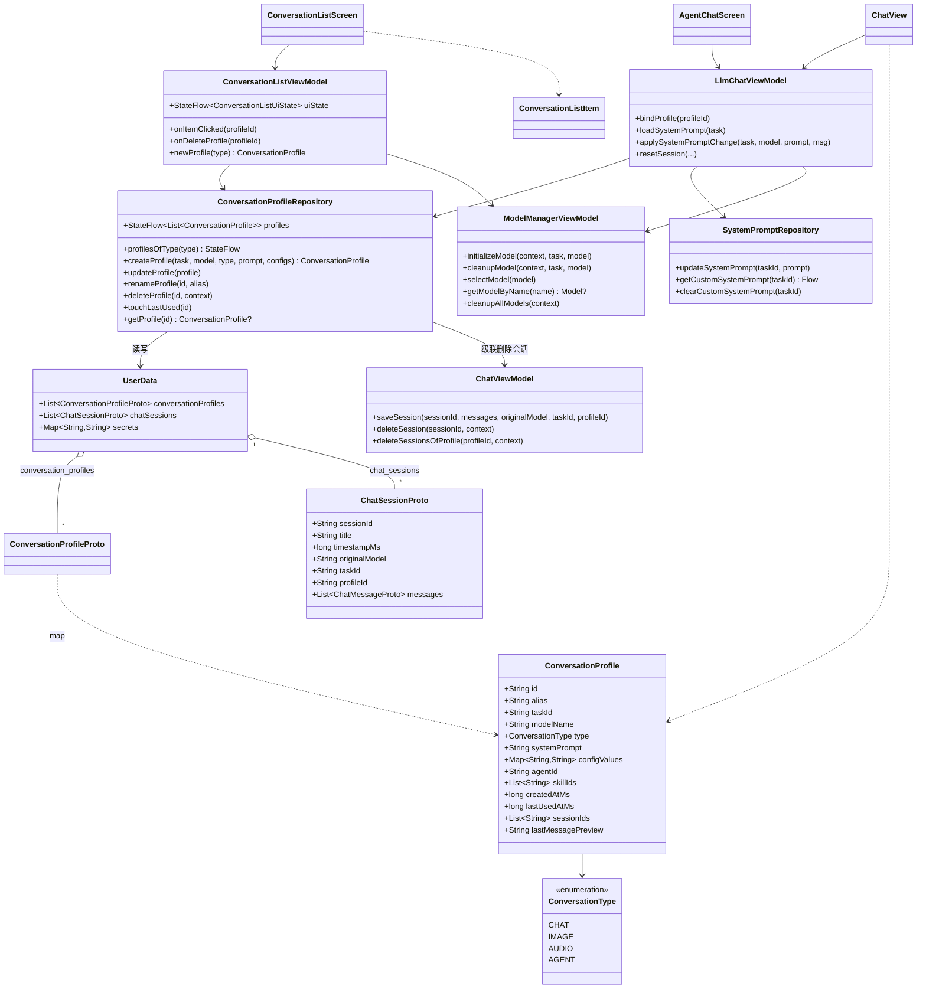
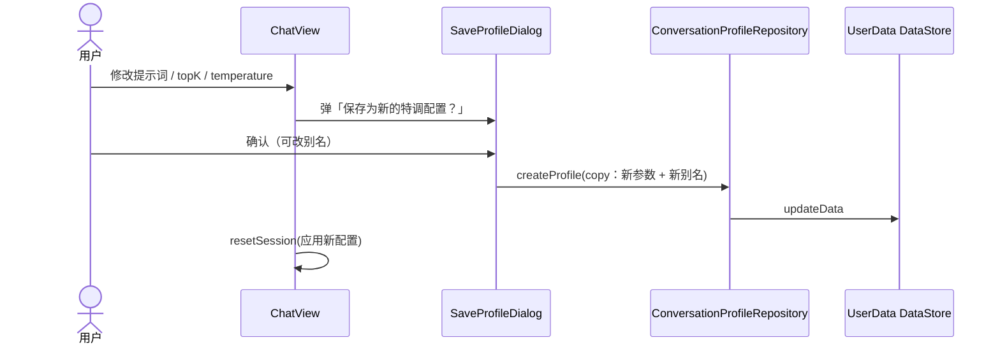
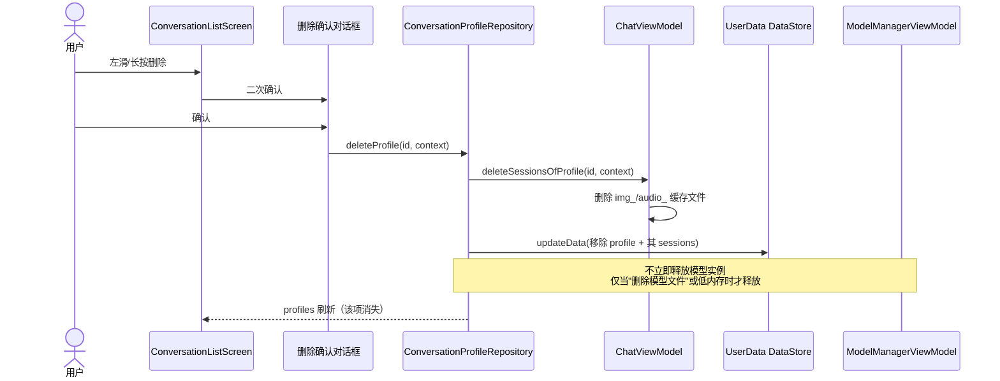
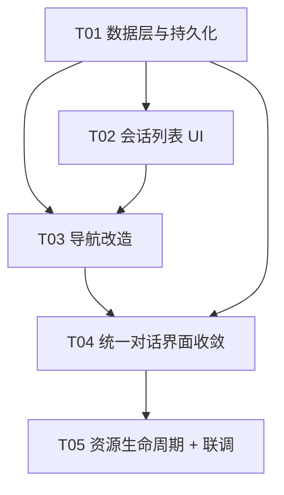

# 会话列表改造 · 增量设计说明（SeAI_Encourage）

> 目标：把底部 Tab「对话」「功能」从**直达单一对话界面**，改造为**微信式会话列表**；
> 收敛冗余界面为**一个统一对话界面**；理顺模型资源加载/释放时机。
>
> 本文为**增量设计（只设计、不改业务代码）**，供工程师照此实现。
> 现状基线：底部五 Tab（commit `ae8175d`）+ 任务驱动架构（`CustomTask` / Hilt `Set<CustomTask>`）。

---

## 〇、结论速览（先看这段）

| # | 问题 | 结论 |
|---|---|---|
| 1 | 是否存在"两套 Agent Skills 界面"？ | **不存在。** 「功能」Tab 与能力选择器里的 Agent Skills **是同一个 `AgentChatScreen`**，只是两条**入口路径**（顶层带底栏 / 二级全屏）。用户感知的"两套 + bug 不同"来自**导航上下文**，不是两份实现。 |
| 2 | 保留哪套？ | 保留**全屏**（`route_model/llm_agent_chat/...`，隐藏底栏），把「功能」Tab 改成列表页，点击列表项走全屏路由；**砍掉能力选择器里那个会嵌套导航的 chip 入口**。 |
| 3 | 识图 / 语音 独立界面？ | **是冗余。** `LlmAskImageScreen` / `LlmAskAudioScreen` 与 `LlmChatScreen` 底层是**同一个 `ChatView`**，只差 `showImagePicker` / `showAudioPicker` 两个开关。合并为「统一对话界面 + `ConversationType` 属性」。 |
| 4 | 会话记录怎么存？ | 新增 proto 实体 `ConversationProfileProto`（"模型特调配置"），复用 `UserData` DataStore（新增 `conversation_profiles` 字段 + `ChatSessionProto.profile_id` 字段），protobuf-lite 序列化。 |
| 5 | 模型何时释放？ | 改为**"加载后保活，仅切换模型 / 切换采样参数时释放"**；删除 `ChatView`/`CustomTaskScreen` 里"每次退页全量 cleanup"的逻辑。 |

---

# Part A · 系统设计

## 1. 实现思路

### 1.1 核心难点

| 编号 | 难点 | 说明 |
|---|---|---|
| **C1** | 「会话记录（特调配置）」是新概念，无现成载体 | 现有 `ChatSessionProto` 只描述"一次对话"（session_id/title/messages），**没有"配置层"**。需要新增实体并持久化。 |
| **C2** | 现有"系统提示词"是 **per-task 全局**的 | `SystemPromptRepository` 的 key 是 `system_prompt_$taskId`（见 `data/SystemPromptRepository.kt:32`），**不是 per-session**。而需求要求"每个记录有自己的角色设定" → 提示词必须**下沉到记录实体**。 |
| **C3** | 模型资源生命周期与需求 5 冲突 | 现在 `ChatView.handleNavigateUp`（`ChatView.kt:424-434`）与 `GalleryNavGraph.CustomTaskScreen.onNavigateUp`（`GalleryNavGraph.kt:450-471`）会在**每次退页时清理该任务全部模型**。需求 5 明确要求"**切换具体模型时再释放**"。 |
| **C4** | 两个"进入 Agent Skills"的路径 | 需要确认是否两套实现 → 实际同一实现（见 §1.3）。 |
| **C5** | 同一模型多个特调实例的内存问题 | 多个记录指向同一 `model_name` 时若各自 `initializeModel`，会重复占用内存。必须保证**一个模型只有一个 runtime 实例**。 |

### 1.2 技术选型（保持现状，不引入新框架）

| 层次 | 选型 | 理由 |
|---|---|---|
| UI | Jetpack Compose + Material 3 | 与现状一致，`HubListItem` / `EmptyState` 可复用 |
| 状态 | MVVM + `StateFlow` 单向数据流 | 与 `ModelManagerViewModel` / `LlmChatViewModel` 一致 |
| DI | Hilt（`@HiltViewModel` / `@Provides @Singleton`） | 与 `di/AppModule.kt` 一致 |
| 持久化 | **Proto DataStore（protobuf-lite + kotlin-lite）** | 复用现有 `UserDataSerializer` / `AppModule` DataStore 基建，零新增依赖 |
| 导航 | Navigation Compose（`NavHost` + 路由） | 复用 `GalleryNavGraph` / `AppRoutes.isTopLevelRoute` 底栏策略 |
| 架构模式 | 任务驱动（`CustomTask`）+ 领域仓库 | 不破坏现有链路 |

### 1.3 关键研判 A：Agent Skills「两套界面」的真相

**两条入口路径对比：**

| 维度 | 路径 A：能力选择器 | 路径 B：「功能」Tab |
|---|---|---|
| 触发 | 对话页输入框上方 chip「Agent Skills」 | 底部「功能」Tab |
| 代码 | `ChatPanel.kt:919-923` `onNavigateToTask(capTask)` → `GalleryNavGraph.kt:429-432` | `GalleryNavGraph.kt:301-310` `TaskTabScreen(taskId=llm_agent_chat)` |
| 路由 | `route_model/llm_agent_chat/{model}`（**二级页，隐藏底栏**） | `tab_agent`（**顶层页，显示底栏**） |
| 渲染 | `isLegacyTasks(llm_agent_chat)==true` → `customTask.MainScreen(CustomTaskDataForBuiltinTask)` | 同左 → `customTask.MainScreen(...)` |
| 最终界面 | `AgentChatTask.MainScreen` → **`AgentChatScreen`** | `AgentChatTask.MainScreen` → **`AgentChatScreen`** |
| 差异点 | `popUpTo(AppRoutes.TAB_CHAT)` 造成**嵌套导航**；复用当前选中模型 | `TaskTabScreen` 自动选"已下载第一个模型" + 无模型引导弹窗；顶层返回语义 |

> **结论**：两处最终都调用 `customtasks/agentchat/AgentChatScreen.kt`（`AgentChatTaskModule.kt:206-217`），
> **是同一个界面**。所谓"两套" = **一个界面 + 两条入口**。差异来自**导航上下文**（顶层 Tab vs 嵌套二级页），
> 不是两份 UI 实现。

**推荐处理**（等价于"保留 bug 少的全屏那套，砍掉有 bug 的"）：
- **保留全屏路径** `route_model/llm_agent_chat/{modelName}?profileId=...`（隐藏底栏 = 用户说的"全屏"）；
- 「功能」Tab 改为 **Agent Skills 会话列表**，点击列表项 → 走全屏路径；
- **删除能力选择器**（连同产生嵌套导航的 chip 入口，`ChatPanel.kt:893-928`）。

### 1.4 关键研判 B：冗余界面梳理（用户要求"理顺功能与界面关系"）

| 界面 | 底层实现 | 差异 | 判定 |
|---|---|---|---|
| AI Chat（`llm_chat`） | `ChatView` | `showImagePicker=true, showAudioPicker=true` | **保留为唯一统一对话界面** |
| Ask Image（`llm_ask_image`） | **同一个 `ChatView`** | `showImagePicker=true, showAudioPicker=false` + 独立空态 | **冗余 → 降级为 `ConversationType.IMAGE` 预设** |
| Audio Scribe（`llm_ask_audio`） | **同一个 `ChatView`** | `showImagePicker=false, showAudioPicker=true` + 独立空态 | **冗余 → 降级为 `ConversationType.AUDIO` 预设** |
| Agent Skills（`llm_agent_chat`） | `ChatView` + Skill/MCP/Agent 管理 | 额外 skill/mcp/agent 选择器 + 进度面板 | **保留**（功能确有增量，非冗余） |
| Prompt Lab（`llm_prompt_lab`） | **另一套** `LlmSingleTurnScreen` | 单轮问答，独有 4 类模板 | **保留**（实验 Tab，非同一界面） |

> **统一方案**：识图 / 语音**不再有独立界面**，统一走 `ChatView`，仅由 `ConversationType` 决定
> `showImagePicker/showAudioPicker` 与空态文案。满足"**只保留一个统一对话界面**"。

---

## 2. 文件清单

### 2.1 新增文件

| # | 相对路径 | 说明 |
|---|---|---|
| N1 | `app/src/main/proto/conversation_profile.proto` | 新增实体：`ConversationProfileProto` + `ConversationType` 枚举 |
| N2 | `app/src/main/java/com/encourage/app/data/conversation/ConversationProfile.kt` | 领域模型 + proto ↔ domain 映射 |
| N3 | `app/src/main/java/com/encourage/app/data/conversation/ConversationProfileRepository.kt` | 仓库：CRUD + `StateFlow` + 级联删除 |
| N4 | `app/src/main/java/com/encourage/app/ui/conversation/ConversationListScreen.kt` | 会话列表页（对话 Tab / 功能 Tab 共用，按 `ConversationType` 过滤） |
| N5 | `app/src/main/java/com/encourage/app/ui/conversation/ConversationListItem.kt` | 列表项（微信式：头像 + 别名 + 模型/类型 + 摘要 + 时间 + 左滑删除） |
| N6 | `app/src/main/java/com/encourage/app/ui/conversation/ConversationListViewModel.kt` | 列表 VM（观察 profiles、删除、新建） |
| N7 | `app/src/main/java/com/encourage/app/ui/conversation/SaveProfileDialog.kt` | "另存为新的特调配置"对话框（改提示词/参数时触发） |

### 2.2 修改文件

| # | 相对路径 | 改动 | 一句话说明 |
|---|---|---|---|
| M1 | `app/src/main/proto/chat_history.proto` | 改 | `ChatSessionProto` 新增 `string profile_id = 7`（记录归属） |
| M2 | `app/src/main/proto/settings.proto` | 改 | `UserData` 新增 `repeated ConversationProfileProto conversation_profiles = 6` |
| M3 | `app/src/main/java/com/encourage/app/ui/navigation/GalleryNavGraph.kt` | 改 | Tab1/Tab2 内容改列表页；`route_model` 增 `profileId`/`conversationType`；模型 Tab 新建记录流转 |
| M4 | `app/src/main/java/com/encourage/app/ui/navigation/TaskTabScreen.kt` | 改 | 由"直达对话页"改为"列表页载体"（或由 N4 取代后废弃） |
| M5 | `app/src/main/java/com/encourage/app/ui/navigation/BottomNavBar.kt` | 改 | （可选）Tab 文案/注释对齐"列表"语义 |
| M6 | `app/src/main/java/com/encourage/app/ui/common/chat/ChatPanel.kt` | 改 | **删除能力选择器**（`ChatPanel.kt:893-928` + `onNavigateToTask` 参数链） |
| M7 | `app/src/main/java/com/encourage/app/ui/common/chat/ChatView.kt` | 改 | 去能力选择器；绑定 `profileId`；**退页不再全量 `cleanupModel`** |
| M8 | `app/src/main/java/com/encourage/app/ui/llmchat/LlmChatScreen.kt` | 改 | 去 `onNavigateToTask`；合并 Ask Image/Audio 到统一入口；透传 `profileId`/`type` |
| M9 | `app/src/main/java/com/encourage/app/ui/llmchat/LlmChatViewModel.kt` | 改 | 新增 `bindProfile(profileId)`：从记录加载 `systemPrompt` / `configs` |
| M10 | `app/src/main/java/com/encourage/app/ui/common/chat/ChatViewModel.kt` | 改 | `saveSession` 增 `profileId`；新增 `deleteSessionsOfProfile`（级联） |
| M11 | `app/src/main/java/com/encourage/app/ui/llmchat/LlmChatTaskModule.kt` | 改 | `LlmAskImageTask`/`LlmAskAudioTask` 的独立 `MainScreen` 收敛（保留 task 常量做类型/旧数据兼容） |
| M12 | `app/src/main/java/com/encourage/app/ui/modelmanager/ModelHubScreen.kt` | 改 | 识图/语音项点击 → `onCreateProfile(task, type)` 而非进模型列表 |
| M13 | `app/src/main/java/com/encourage/app/ui/modelmanager/ModelManagerViewModel.kt` | 改 | 新增 `cleanupAllModels()`；暴露"低内存/后台释放"入口；保证同模型单实例 |
| M14 | `app/src/main/java/com/encourage/app/di/AppModule.kt` | 改 | （仅当选择"独立 DataStore"方案时）注册新 `DataStore<ConversationProfiles>` |
| M15 | `app/src/main/res/values/strings.xml` + `values-zh/strings.xml` | 改 | 新增列表空态、类型标签、"另存为特调"、删除确认等文案（中英双语） |

### 2.3 建议后续清理（非本次必须）

| 文件 | 说明 |
|---|---|
| `ui/home/HomeScreen.kt` | 已是死代码（不再被路由），后续统一删除 |
| `ui/llmchat/LlmChatScreen.kt` 的 `LlmAskImageScreen` / `LlmAskAudioScreen` | 合并后删除（下层 `ChatView` 保留） |

---

## 3. 数据结构与接口

### 3.1 新增 proto：`conversation_profile.proto`

```proto
syntax = "proto3";
package com.encourage.app.proto;
option java_package = "com.encourage.app.proto";
option java_outer_classname = "ConversationProfile";
option java_multiple_files = true;

// 会话类型：决定列表图标 / 统一对话界面的输入能力开关。
enum ConversationType {
  CONVERSATION_TYPE_UNSPECIFIED = 0;
  CONVERSATION_TYPE_CHAT = 1;   // 对话（文字）
  CONVERSATION_TYPE_IMAGE = 2;  // 识图
  CONVERSATION_TYPE_AUDIO = 3;  // 语音
  CONVERSATION_TYPE_AGENT = 4;  // Agent Skills
}

// 一条「模型特调配置」记录（= 微信里的一个"联系人"）。
message ConversationProfileProto {
  string id = 1;                          // UUID，稳定主键
  string alias = 2;                       // 用户可命名，默认 "{模型名} 特调"
  string task_id = 3;                     // llm_chat / llm_ask_image / llm_ask_audio / llm_agent_chat
  string model_name = 4;                  // 关联模型（Model.name，唯一标识）
  ConversationType type = 5;              // 对话 / 识图 / 语音 / Agent
  string system_prompt = 6;               // 角色设定（per-record，替代全局 per-task）
  map<string,string> config_values = 7;   // topK/temperature/topp/accelerator…（字符串化）
  string agent_id = 8;                    // Agent 专有：选中的 Agent（可空）
  repeated string skill_ids = 9;          // Agent 专有：选中的 Skill 短 id（可空）
  int64 created_at_ms = 10;               // 创建时间
  int64 last_used_at_ms = 11;             // 最后使用时间（列表按此倒序）
  repeated string session_ids = 12;       // 该记录名下的会话 id（倒序，最新在前）
  string last_message_preview = 13;       // 冗余字段：列表直接展示，避免遍历 messages
}
```

### 3.2 类图



### 3.3 数据表（字段清单）

**`ConversationProfile`（领域模型）**

| 字段 | 类型 | 默认值 | 说明 |
|---|---|---|---|
| `id` | String | UUID | 主键 |
| `alias` | String | `"{model.displayName ?: model.name} 特调"` | 别名；Agent 类型追加 `" · Agent"` |
| `taskId` | String | 按入口 | `llm_chat` / `llm_ask_image` / `llm_ask_audio` / `llm_agent_chat` |
| `modelName` | String | 当前模型 | 关联模型（唯一） |
| `type` | ConversationType | 按入口 | `CHAT` / `IMAGE` / `AUDIO` / `AGENT` |
| `systemPrompt` | String | `task.defaultSystemPrompt` 或空 | 角色设定 |
| `configValues` | Map<String,String> | 模型默认参数 | key 用 `ConfigKey.id`（如 `topk`） |
| `agentId` | String | `""` | Agent 专有 |
| `skillIds` | List<String> | `[]` | Agent 专有 |
| `createdAtMs` | long | `now` | 创建时间 |
| `lastUsedAtMs` | long | `now` | 最后使用时间 |
| `sessionIds` | List<String> | `[]` | 名下会话（倒序） |
| `lastMessagePreview` | String | `""` | 列表摘要 |

**`UserData`（现有，新增字段）**

| 字段 | 类型 | 说明 |
|---|---|---|
| `conversation_profiles` | `repeated ConversationProfileProto` | **新增**（字段号 6，向后兼容） |

**`ChatSessionProto`（现有，新增字段）**

| 字段 | 类型 | 说明 |
|---|---|---|
| `profile_id` | `string` | **新增**（字段号 7）。空 = 旧数据（未迁移） |

**持久化方案选型对比**

| 方案 | 说明 | 结论 |
|---|---|---|
| **A. 复用 `UserData` DataStore**（推荐） | `UserData` 已存 `chat_sessions`；新增 `conversation_profiles` 字段 + `ChatSessionProto.profile_id` | ✅ **推荐**：会话与记录强关联，**单次原子写入**，避免跨文件不一致；不加 DataStore 实例 |
| B. 新开 `conversation_profiles.pb` | 独立 `DataStore<ConversationProfiles>` + `AppModule` 注册 | 备选：若 `UserData` 体积过大再拆分；代价是 profile↔session 跨文件，删除需两次写 |

> 序列化：**protobuf-lite**（现有 `app/build.gradle.kts:190` 配置）。`config_values` 用
> `map<string,string>`，写入用 `Model.getStringConfigValue()`（`data/Model.kt:399`）语义，
> 读回用 `convertValueToTargetType()`（`data/Config.kt:230`）解析。

### 3.4 与「现有对话历史存储」的关联

现状：`ChatViewModel.saveSession()`（`ChatViewModel.kt:415`）把会话写入 `UserData.chat_sessions`；
`ChatView` 读取时按 `taskId` 过滤（`ChatView.kt:325-326`）。

改造后关系：**`ConversationProfile` 1 ── N `ChatSessionProto`**（记录拥有多条会话）。

```
ConversationProfile(id)  ──profile_id──▶  ChatSessionProto(session_id, ...)
        │
        └─ session_ids = [s3, s2, s1]   // 倒序，最新在前
```

- 点击列表项 → 打开该记录的**最新会话**（`session_ids.first()`；无则新建空会话）；
- 记录内"新建对话"→ 新建 session 并挂到 `session_ids` 头部；
- 删除记录 → **级联删除**名下所有 session（含图片/音频缓存文件）；
- 现有"历史会话抽屉"（`ChatHistorySideSheet.kt`）可保留，但过滤条件从 `taskId` 改为 `profileId`。

> 与 `SystemPromptRepository` 的关系：现有 per-task key（`system_prompt_$taskId`）**继续保留**
> 用于兼容；记录级提示词存在 `ConversationProfile.systemPrompt`。`LlmChatViewModel.bindProfile()`
> 优先用记录的提示词，回退到 `SystemPromptHelper.getEffectiveSystemPrompt()`。

---

## 4. 程序调用流程

### 4.1 时序图 · 从「模型」Tab 新建并进入（以识图为例）

```mermaid
sequenceDiagram
    actor U as 用户
    participant MHub as ModelHubScreen
    participant Nav as GalleryNavHost
    participant Repo as ConversationProfileRepository
    participant Store as UserData DataStore
    participant MVM as ModelManagerViewModel
    participant Chat as LlmChatScreen/ChatView

    U->>MHub: 点击「识图 Ask Image」
    MHub->>Nav: onTaskSelected(task, type=IMAGE)
    Nav->>MVM: 取"已下载的第一个模型"（无则引导去模型 Tab）
    MVM-->>Nav: model
    Nav->>Repo: createProfile(task, model, type=IMAGE, prompt, configs)
    Repo->>Store: updateData(追加 ConversationProfileProto)
    Repo-->>Nav: ConversationProfile(id)
    Nav->>Nav: navigate(route_model/llm_chat/{model}?profileId=id&type=IMAGE)
    Nav->>Chat: 渲染统一对话界面(showImagePicker=true, showAudioPicker=true)
    Chat->>MVM: selectModel(model); initializeModel()（已初始化则跳过，不重复加载）
    Chat->>Repo: getProfile(id) 读取 systemPrompt/configValues
    Chat-->>U: 全屏会话（隐藏底栏）
```

### 4.2 时序图 · 从列表点击进入

```mermaid
sequenceDiagram
    actor U as 用户
    participant List as ConversationListScreen
    participant Repo as ConversationProfileRepository
    participant Nav as GalleryNavHost
    participant MVM as ModelManagerViewModel
    participant Chat as ChatView
    participant Store as UserData DataStore

    U->>List: 点击某条记录
    List->>Repo: getProfile(id)
    Repo-->>List: profile
    List->>Nav: navigate(route_model/{taskId}/{modelName}?profileId=id)
    Nav->>MVM: getModelByName(profile.modelName)
    alt 模型已初始化 且 采样参数相同
        Nav->>Chat: 复用同一 runtime 实例（不重载）
    else 采样参数不同 / 换了模型
        Nav->>MVM: cleanupModel(prevModel) ; selectModel(new) ; initializeModel(new)
    end
    Chat->>Repo: bindProfile(id) → resetSession(systemPrompt=profile.prompt)
    Repo->>Store: touchLastUsed(id)（更新 last_used_at_ms）
    Chat-->>U: 全屏会话
```

### 4.3 时序图 · 修改提示词/参数 → 另存为新记录



### 4.4 时序图 · 删除记录（微信删好友逻辑）



---

## 5. 页面结构

| 页面 | 职责 | 实现文件 | 复用关系 |
|---|---|---|---|
| **对话 Tab 列表页** | 微信式列表，展示 `type ∈ {CHAT, IMAGE, AUDIO}` 的记录 | `ConversationListScreen(filter=CHAT/IMAGE/AUDIO)` | 与"功能 Tab 列表"**同一组件**，靠 `filter` 区分 |
| **功能 Tab 列表页** | Agent Skills 会话列表，展示 `type == AGENT` 的记录 | `ConversationListScreen(filter=AGENT)` | 同上 |
| **全屏对话页** | 统一对话界面（文字/图片/音频/拍照/录音） | `route_model/{taskId}/{modelName}?profileId=&type=` → `LlmChatScreen` → `ChatView` | **唯一**对话界面 |
| **全屏 Agent Skills 页** | Agent 对话（Skill/MCP/Agent 管理） | 同上路由，`taskId=llm_agent_chat` → `AgentChatScreen` → `ChatView` | 复用同一路由 + `ChatView` |
| **实验 Tab** | Prompt Lab（单轮） | 现有 `LlmSingleTurnScreen` | 保留，不动 |
| **模型 Tab** | 5 项入口 | `ModelHubScreen` | 识图/语音项点击行为改为"新建记录" |

---

## 6. 导航设计

### 6.1 路由表

| 路由 | 类型 | 底栏 | 说明 |
|---|---|---|---|
| `tab_chat`（对话） | 顶层 | **显示** | 内容改为 `ConversationListScreen(filter=CHAT,IMAGE,AUDIO)` |
| `tab_agent`（功能） | 顶层 | **显示** | 内容改为 `ConversationListScreen(filter=AGENT)` |
| `tab_lab`（实验） | 顶层 | 显示 | 不变（Prompt Lab） |
| `tab_models`（模型） | 顶层 | 显示 | 4 项点击 → 新建记录；第 5 项进模型管理 |
| `tab_system`（系统） | 顶层 | 显示 | 不变 |
| `route_model/{taskId}/{modelName}?profileId={id}&type={t}&query={q}` | 二级 | **隐藏** | 统一全屏会话（含 Agent） |
| `model_list` / `model_manager` / `benchmark/{name}` / `notifications` | 二级 | 隐藏 | 不变 |

> 底栏策略**复用现有** `AppRoutes.isTopLevelRoute`（`BottomNavBar.kt:57-61`）：
> 仅 5 个顶层路由显示底栏，二级页自动隐藏 —— **无需改动底栏判定逻辑**。

### 6.2 进入 / 返回语义

| 场景 | 进入 | 返回键 |
|---|---|---|
| 列表项 → 全屏会话 | `navigate(route_model/...?profileId=)` | 返回所在列表 Tab，底栏恢复；列表项 `last_used` 刷新 |
| 「模型」Tab 新建 → 全屏会话 | `navigate(...)` | 返回**来源 Tab（模型 Tab）**（推荐） |
| Tab 之间切换 | `popUpTo(start){saveState}; restoreState; launchSingleTop`（现有） | 微信式：回起始 Tab，**各 Tab 保留自身栈** |

### 6.3 Tab 状态保持

沿用现状：`onTabSelected`（`GalleryNavGraph.kt:239-249`）已实现 `saveState/restoreState`。
列表页滚动位置、会话页状态在 Tab 切换时保留。

---

## 7. 从「模型」Tab 进入时的流转（推荐方案）

```
「模型」Tab → 点「识图」/「语音」
  → 取"已下载的第一个模型"（无则弹引导去下载）
  → 【新建一条记录】createProfile(type=IMAGE/AUDIO)
  → 【直接打开全屏会话】navigate(route_model/llm_chat/{model}?profileId=id&type=IMAGE)
  → 返回 → 回到「模型」Tab（来源 Tab）
  → 下次进「对话」Tab 列表，即可看到这条新记录
```

**推荐理由：**
1. **符合用户意图**：用户从"模型"进入就是"想马上用这个模型开聊"，直接进会话最顺；
2. **避免导航抖动**：若"跳到对话 Tab 再自动打开会话"，会造成 `Tab 切换 + 二级页入栈`的多次导航，
   与现有 `popUpTo/restoreState` 叠加易产生状态错乱（正是 bug 高发区）；
3. **记录已持久化**：不依赖"跳转到位"，"对话 Tab 列表"下次自然出现该记录，无副作用。

> 备选（不推荐）：留原地 / 跳到对话 Tab 列表。已列入 §待拍板事项。

---

## 8. 改造点清单（文件 → 改/新增 → 说明）

见 §2.1 / §2.2 两张表（新增 N1–N7，修改 M1–M15）。核心改造点归纳：

| 改造点 | 文件 | 关键动作 |
|---|---|---|
| ① 新增数据层 | N1–N3, M1, M2, M14 | proto 实体 + 仓库 + UserData/字段扩展 |
| ② 会话列表 UI | N4–N6 | 列表页/列表项/VM（两 Tab 共用） |
| ③ 导航收敛 | M3, M4, M5 | Tab1/Tab2 改列表；`route_model` 增 `profileId` |
| ④ 统一对话界面 | M6, M7, M8, M9, M11 | **删除能力选择器**；识图/语音合并为 `ConversationType` |
| ⑤ 记录↔会话绑定 | M10 | `saveSession(profileId)` + 级联删除 |
| ⑥ 模型 Tab 流转 | M12 | 点击 → 新建记录（非进模型列表） |
| ⑦ 资源生命周期 | M7, M13 | 去退页全量 cleanup；`cleanupAllModels()` 兜底 |
| ⑧ 文案 | M15 | 中英双语新增 |

---

## 9. 模型 / Agent / Skill 生命周期与资源释放（需求 5）

### 9.1 持有者与归属

| 资源 | 持有者 | 实例粒度 | 生命周期 |
|---|---|---|---|
| **模型实例** `Model.instance` | `Model` 对象（由 Hilt 单例 `ModelManagerViewModel.types` 持有） | **每个模型 1 份**（进程级复用） | 加载后**保活**；仅"切模型/切采样参数"或"低内存/删模型"时释放 |
| **特调配置** `ConversationProfile` | `ConversationProfileRepository`（单例） | 每条记录 1 份 | 显式删除时销毁 |
| **Agent** | `AgentManagerViewModel` / `assets/agents/*.json` | 无 runtime 实例（纯提示词） | 应用级常驻 |
| **Skill** | `SkillManager` / `SkillsProvider`（单例） | 由 Agent 对话按需 load | 会话重置时按选中集合重算 |

### 9.2 加载时机

- **进入会话页**：`ChatView` 的 `LaunchedEffect(curDownloadStatus, selectedModel.name)` 调
  `initializeModel()`（`ChatView.kt:438-445`）。`initializeModel` **内建"已初始化则跳过"**
  （`ModelManagerViewModel.kt:518-528`），因此**不会每进一次就重复加载** —— 这点现状已正确，保留。

### 9.3 释放时机（**本次核心改动**）

| 触发 | 现状 | 改为 |
|---|---|---|
| **切换具体模型**（`ModelPageAppBar.onModelSelected`） | 释放被切走的模型 | ✅ **保留**（`ChatView.kt:588-597`、`GalleryNavGraph.kt:720-742`）|
| **切换采样参数**（topK/temperature 变化 → `needReinitialization`） | 重新初始化 | ✅ 保留（`initializeModel` 内部先 cleanup）|
| **退出会话页 / 退到后台** | ❌ **每次退页 cleanup 全部模型**（`ChatView.kt:424-434`、`GalleryNavGraph.kt:450-471`） | ✅ **移除该逻辑**（改为不释放） |
| **进程低内存 / 切后台超时** | 无 | ➕ 新增：`ModelManagerViewModel.cleanupAllModels()` + `onTrimMemory` 回调 |
| **删除模型文件**（模型管理页） | 释放该模型 | ✅ 保留并补充：联动处理引用它的记录（标记"模型缺失"） |

> 结论：**"某个模型加载后，只在切换具体模型时再释放资源"** —— 通过**删除退页全量 cleanup**
> 实现；释放点收敛到 **①切模型 ②切参数 ③低内存/后台 ④删模型**。

### 9.4 同一模型的多个特调是否共享实例（内存关键）

- **共享**：多个记录指向同一 `model_name` → `getModelByName()` 返回**同一 `Model` 对象**，
  `Model.instance` **同一份** → **不重复占内存**。
- **例外**：若两条记录的**采样参数不同**（topK/temperature），因参数在 `initializeModel` 时注入运行时，
  切换需**重新初始化**（属运行时限制，非可优化项）。参数相同的记录切换**零重载**。
- **设计约束**（写入 `ConversationProfileRepository`）：记录**绝不持有** `Model.instance`，
  只存 `modelName + configValues`；实例唯一由 `ModelManagerViewModel` 管理。

### 9.5 Agent / Skill 生命周期

- Agent 对话初始化时（`AgentChatTaskModule.kt:149-195`）会 load skills + MCP + 拼 system prompt；
- **记录级**：`ConversationProfile.agentId` / `skillIds` 只是"选中项快照"，进入会话时用于
  `resetSession` 重算 system prompt，**不常驻额外实例**。

---

## 10. 风险与边界

| # | 边界 | 处理方案 |
|---|---|---|
| R1 | **空态**：无任何记录 | 列表页显示 `EmptyState`（复用 `ui/common/EmptyState.kt`）：文案"还没有会话，去「模型」新建或下载模型" + 按钮跳「模型」Tab |
| R2 | **删除记录是否释放模型** | **不立即释放**。理由：用户常"删了马上建新的同模型"；模型实例由 `ModelManagerViewModel` 统一管理，低内存时统一回收 |
| R3 | **模型未下载** | 记录仍展示（灰显）；点击 → 提示"该模型未下载" + 跳模型 Tab 下载。不崩溃 |
| R4 | **下载中被删除 / 模型已不存在** | `getModelByName()` 返回 `null` 时：不拼非法路由；列表项标"模型缺失"；点击给"重新选择模型 / 删除记录"。兜底参考 `ChatViewWrapper`（`LlmChatScreen.kt:247-252`）的"任务未就绪空占位"写法 |
| R5 | **同模型多特调内存** | 见 §9.4：单实例共享；参数不同才重载 |
| R6 | **向后兼容 / 迁移** | `ChatSessionProto.profile_id` 为空 = 旧数据。**推荐惰性迁移**：首次读取时按 `(taskId, originalModel)` 生成一条"历史会话"记录并回填 `profile_id`（一次性、幂等）。备选：在列表顶部显示一个"未分组历史"聚合项 |
| R7 | **记录别名重复** | 允许重名；默认名重复时追加序号（如"Gemma-4 特调 2"） |
| R8 | **并发写** | `DataStore.updateData` 内部串行，天然安全；profile + session 同属 `UserData`，**单次写入**保证一致性 |
| R9 | **`last_message_preview` 冗余字段** | `saveSession` 时同步更新到其 profile；避免列表遍历全部 messages（性能） |
| R10 | **能力选择器删除后的兼容** | 删除 `ChatPanel` 的 `onNavigateToTask` 参数链（`ChatView.kt:310`、`LlmChatScreen.kt:89`），确保"从其它任务对话页跳转"的旧路径一并移除，避免半删除留下无效代码 |
| R11 | **旧任务常量** | `BuiltInTaskId.LLM_ASK_IMAGE/LLM_ASK_AUDIO` **保留**（旧历史分类 + 迁移映射）；不再作为独立界面入口 |
| R12 | **`llm_ask_image` 类型路由** | 识图/语音统一走 `llm_chat`（`taskId=llm_chat`）+ `type` 参数；若需保留旧 taskId 的历史隔离，可在 `ChatView` 历史过滤处兼容 |

---

## 11. 待明确事项（需用户拍板，尽量少）

| # | 问题 | **推荐答案** |
|---|---|---|
| Q1 | 修改提示词/参数时，**自动**新建记录（按原话）还是**询问**"另存为新的特调配置"？ | **询问**（`SaveProfileDialog`）。自动新建会因每次微调产生大量记录，"询问"兼顾原意与整洁 |
| Q2 | 从「模型」Tab 新建后，**直接进全屏会话**（§7 推荐）还是先跳"对话 Tab 列表"？ | **直接进全屏会话**，返回回到来源 Tab |
| Q3 | 同一记录下**允许多个历史会话**（1:N）还是**一对一**（1 record = 1 对话）？ | **1:N**（保留现有"新建对话/历史"能力；列表点击默认进最新会话） |
| Q4 | 旧历史数据迁移：**自动迁移为默认记录** 还是保留为"未分组历史"？ | **惰性自动迁移**（按 `(taskId, model)` 归并为默认记录），无数据丢失 |
| Q5 | 「功能」Tab 列表项是否展示"Agent + Skill 数"摘要？ | **展示**（如"编程助手 · 5 Skills"） |
| Q6 | 删除记录是否需要**二次确认对话框**（微信式）？ | **需要**（防误删，删除会连带聊天记录） |

---

# Part B · 任务分解

## 12. 依赖包

| 包 | 用途 | 状态 |
|---|---|---|
| `com.google.protobuf:protobuf-javalite` / `protobuf-kotlin-lite` | proto 序列化 | ✅ 已在 `app/build.gradle.kts:152-153` |
| `androidx.datastore:datastore` | 持久化 | ✅ 已有 |
| `androidx.navigation:navigation-compose` | 路由 | ✅ 已有 |
| `androidx.compose.material3:material3` | UI（`NavigationBar`/`FilterChip`/`AlertDialog`） | ✅ 已有 |
| `com.google.dagger:hilt-*` | DI | ✅ 已有 |

> **无需新增任何第三方包。** 全部复用现有依赖。

## 13. 任务列表（有序，标依赖，≤5 个）

### T01 · 数据层与持久化（P0）
- **源文件**：`proto/conversation_profile.proto`(N1)、`proto/chat_history.proto`(M1)、`proto/settings.proto`(M2)、`data/conversation/ConversationProfile.kt`(N2)、`data/conversation/ConversationProfileRepository.kt`(N3)、`ui/common/chat/ChatViewModel.kt`(M10)、`di/AppModule.kt`(M14)、`res/values/strings.xml` + `values-zh/strings.xml`(M15 基础文案)
- **依赖**：无
- **优先级**：P0
- **内容**：定义 proto 实体与字段扩展 → 生成 proto-lite → 领域模型 + 映射 → 仓库（CRUD/StateFlow/级联删除/惰性迁移）→ `saveSession` 增 `profileId` → 文案
- **验收**：编译通过；新增记录重启后仍在；删除记录连聊天记录一起删

### T02 · 会话列表 UI（P0）
- **源文件**：`ui/conversation/ConversationListScreen.kt`(N4)、`ConversationListItem.kt`(N5)、`ConversationListViewModel.kt`(N6)、`SaveProfileDialog.kt`(N7)
- **依赖**：T01
- **优先级**：P0
- **内容**：微信式列表页（复用 `HubListItem`/`EmptyState`）、列表项（头像+别名+模型/类型+摘要+时间+左滑删除）、空态、删除二次确认、"另存为特调"对话框
- **验收**：列表按 `last_used` 倒序；空态有引导；删除有确认

### T03 · 导航改造（P0）
- **源文件**：`ui/navigation/GalleryNavGraph.kt`(M3)、`ui/navigation/TaskTabScreen.kt`(M4)、`ui/navigation/BottomNavBar.kt`(M5)
- **依赖**：T01、T02
- **优先级**：P0
- **内容**：Tab1/Tab2 内容改为 `ConversationListScreen`；`route_model` 增 `profileId`/`type` 参数；列表项点击 → 全屏会话；模型 Tab 新建记录流转；Tab 状态保持
- **验收**：列表页显示底栏，进会话隐藏底栏；返回语义正确；Tab 切换保栈

### T04 · 统一对话界面收敛（P0）
- **源文件**：`ui/common/chat/ChatPanel.kt`(M6)、`ui/common/chat/ChatView.kt`(M7)、`ui/llmchat/LlmChatScreen.kt`(M8)、`ui/llmchat/LlmChatViewModel.kt`(M9)、`ui/llmchat/LlmChatTaskModule.kt`(M11)、`ui/modelmanager/ModelHubScreen.kt`(M12)
- **依赖**：T01、T03
- **优先级**：P0
- **内容**：**删除能力选择器**（`ChatPanel.kt:893-928` + `onNavigateToTask` 链）；识图/语音合并为 `ConversationType` 预设；`bindProfile()` 加载记录级 prompt/configs；模型 Tab 识图/语音点击 → 新建记录
- **验收**：不存在能力选择器；识图/语音/对话为同一界面；Agent Skills 全屏可达

### T05 · 资源生命周期 + 联调（P0）
- **源文件**：`ui/common/chat/ChatView.kt`(M7 续)、`ui/modelmanager/ModelManagerViewModel.kt`(M13)、`ui/navigation/GalleryNavGraph.kt`(M3 续)
- **依赖**：T04
- **优先级**：P0
- **内容**：**移除退页全量 cleanup**（`ChatView.kt:424-434`、`GalleryNavGraph.kt:450-471`）；新增 `cleanupAllModels()` + 低内存/后台释放；保证同模型单实例；边界兜底（模型缺失/未下载/下载中删除）；全流程联调
- **验收**：进会话不重复加载；切模型才释放；同模型多特调不重复占内存；无崩溃/白屏

## 14. 共享知识（跨任务约定）

```
1. 持久化：一律走 Proto DataStore（protobuf-lite）。新增字段用「全新字段号」保证向后兼容。
2. 记录与会话：ConversationProfile 1:N ChatSessionProto，靠 ChatSessionProto.profile_id 关联；
   删除记录必须级联删除名下会话（含 cacheDir 里 img_/audio_ 缓存文件）。
3. 配置键：config_values 的 key 统一用 ConfigKey.id（如 topk/temperature），
   不要用 key.label（受语言影响）。
4. 模型实例：一个模型只有一个 Model.instance，由 ModelManagerViewModel 统一管理；
   ConversationProfile 绝不持有实例，只存 modelName + configValues。
5. 资源释放：只在 ①切模型 ②切采样参数 ③低内存/后台 ④删模型 时释放；
   绝不在"退出会话页"时释放。
6. 导航：仅 AppRoutes.TOP_LEVEL_ROUTES 显示底栏；二级页自动隐藏（复用 isTopLevelRoute）。
7. 健壮性：任何 getModelByName/getProfile 返回 null 都必须兜底（空态/提示），绝不 !!/崩溃。
8. 文案：中英双语同步更新 values/strings.xml 与 values-zh/strings.xml。
9. 任务 ID：保留 BuiltInTaskId 常量（旧数据兼容）；统一对话界面用 llm_chat + type 区分。
```

## 15. 任务依赖图



---

## 附录 A · 关键代码位置索引（供工程师定位）

| 内容 | 位置 |
|---|---|
| 底栏与顶层路由判定 | `ui/navigation/BottomNavBar.kt:49-62` |
| Tab1/Tab2 现状内容 | `ui/navigation/GalleryNavGraph.kt:288-310` |
| 二级对话页路由 | `ui/navigation/GalleryNavGraph.kt:392-491` |
| 能力选择器（**待删**） | `ui/common/chat/ChatPanel.kt:893-928` |
| 退页全量 cleanup（**待删**） | `ui/common/chat/ChatView.kt:424-434`；`ui/navigation/GalleryNavGraph.kt:450-471` |
| 切模型释放（保留） | `ui/common/chat/ChatView.kt:588-597`；`GalleryNavGraph.kt:720-742` |
| 模型初始化（跳过已初始化） | `ui/modelmanager/ModelManagerViewModel.kt:498-592` |
| 模型清理 | `ui/modelmanager/ModelManagerViewModel.kt:594-638` |
| 会话保存 / 删除 | `ui/common/chat/ChatViewModel.kt:415-559` |
| per-task 系统提示词 | `data/SystemPromptRepository.kt:32-77` |
| 识图/语音降级目标 | `ui/llmchat/LlmChatTaskModule.kt:211-300/305-394` |
| Agent 唯一实现 | `customtasks/agentchat/AgentChatScreen.kt:127`；`AgentChatTaskModule.kt:206-217` |
| 模型 Tab 5 项 | `ui/modelmanager/ModelHubScreen.kt:52-128` |

## 附录 B · 迁移映射（旧数据 → 记录）

| 旧数据 | 迁移动作 |
|---|---|
| `ChatSessionProto{task_id, original_model, profile_id=""}` | 按 `(task_id, original_model)` 归并，生成 `ConversationProfile{type=按 taskId 映射, model_name=original_model, alias="{model} 特调（历史）"}`, 回填其 `profile_id` |
| taskId → type | `llm_chat→CHAT`、`llm_ask_image→IMAGE`、`llm_ask_audio→AUDIO`、`llm_agent_chat→AGENT` |
| 触发时机 | 仓库首次 `load()` 时惰性执行一次，幂等（已迁移的 profile_id 非空则跳过） |
